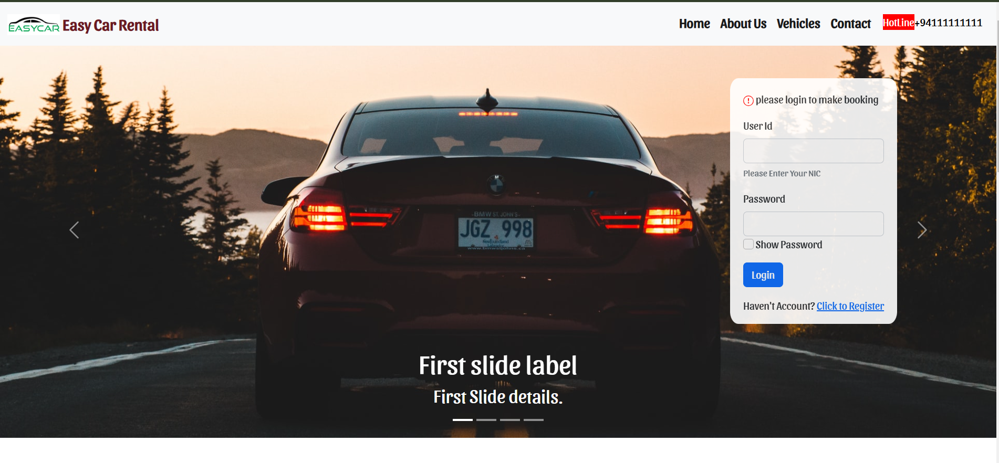

# Easy_CarRental
Spring MVC+maven (car rental system)

A website for online car rental service.

## Tech Stack

This webpage created using HTML, CSS and Javascript. Use Bootstrap as a CSS framework and jQuery as a JS framework.
Use Spring MVC (A Java framework) for backend development and MySql for persist data.

| Languages                | Frameworks                  | Database |
|:-------------------------|:----------------------------|:---------|
| HTML,CSS,JavaScript,Java | jQuery,Bootstrap,Spring MVC | MySQL    |

